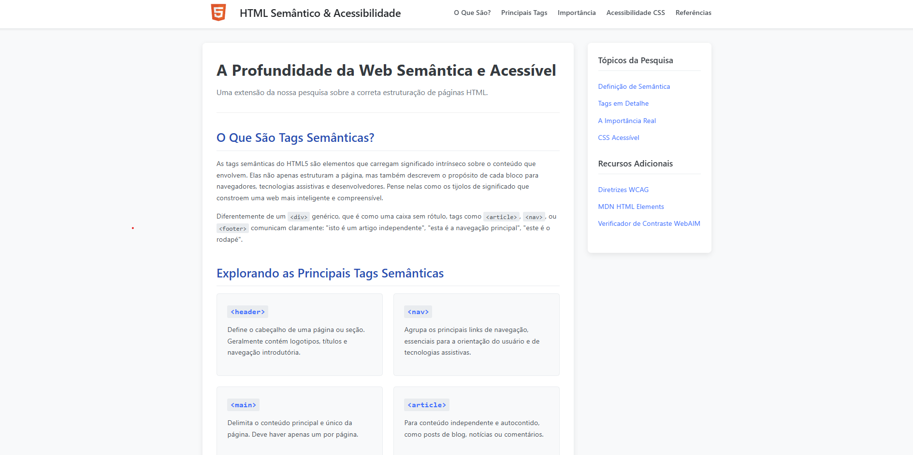

# 🚀 Projeto TAGs HTML Semântico & Acessibilidade Web ♿

Bem-vindo ao repositório do projeto prático sobre **HTML Semântico e Acessibilidade Web**! Esta página é uma demonstração viva dos conceitos aprendidos e discutidos na pesquisa sobre como construir uma web mais significativa, estruturada e inclusiva para todos.




## 🌟 Sobre o Projeto

Este projeto foi desenvolvido com os seguintes focos principais:

* **HTML Semântico ao Extremo:** Utilização correta e extensiva de tags como `<header>`, `<nav>`, `<main>`, `<article>`, `<section>`, `<aside>`, `<footer>`, `<figure>`, `<time>`, e mais, para dar significado real à estrutura do conteúdo.
* **Acessibilidade (a11y) em Primeiro Lugar:** Implementação de diversas práticas de acessibilidade para garantir que a página seja utilizável pelo maior número de pessoas possível, incluindo:
    * Navegação por teclado clara e funcional.
    * Contraste de cores adequado (seguindo as diretrizes WCAG).
    * Uso de atributos ARIA quando necessário.
    * Textos alternativos para imagens.
    * Links "Pular para o conteúdo".
    * Design responsivo.
* **CSS Moderno e Clean:** Estilização pensada para ser agradável, legível e que também contribua para a acessibilidade.

## 🛠️ Como Executar o Projeto Localmente

Para visualizar este projeto em sua máquina, siga os passos abaixo:

### Pré-requisitos

* Um navegador web moderno (Chrome, Firefox, Edge, etc.) 🌐
* [Visual Studio Code (VS Code)](https://code.visualstudio.com/download) instalado 💻 (Recomendado)

### Passos para Instalação e Execução

1.  **Clone ou Baixe o Repositório:**
    * **Opção 1: Clonar via Git (recomendado se você tem Git instalado)**
        ```bash
        git clone https://github.com/danielcorte/tags_semanticas.git
        ```

    * **Opção 2: Baixar o ZIP**
        Clique em "Code" (o botão verde nesta página do GitHub) -> "Download ZIP". Depois, extraia o arquivo ZIP em uma pasta de sua preferência.

2.  **Abra o Projeto no VS Code:**
    * Abra o VS Code.
    * Vá em `File` (Arquivo) > `Open Folder...` (Abrir Pasta...).
    * Selecione a pasta onde você clonou ou extraiu o projeto e clique em "Selecionar Pasta".

3.  **Instale a Extensão "Live Server" (se ainda não tiver):**
    * No VS Code, vá para a aba de Extensões (ícone de quadrados no menu lateral, ou `Ctrl+Shift+X`).
    * Procure por `Live Server` (geralmente a de Ritwick Dey é a mais popular).
    * Clique em `Install` (Instalar).
     *(Exemplo de como a extensão aparece)*

4.  **Execute o Projeto com o Live Server:**
    * Com o projeto aberto no VS Code, localize o arquivo `index.html` na árvore de arquivos.
    * Clique com o botão direito do mouse sobre o arquivo `index.html`.
    * Selecione a opção `Open with Live Server` (Abrir com Live Server).
    * Seu navegador padrão deverá abrir automaticamente com a página do projeto carregada! 🎉
    * Alternativamente, você pode clicar no botão `Go Live` que aparece na barra de status do VS Code (canto inferior direito).


E pronto! Agora você pode explorar a página e o código. 😊

## 💡 Contribuições ou Sugestões

Sinta-se à vontade para abrir *issues* caso encontre algum problema ou tenha sugestões para melhorar o projeto. Este é um projeto de aprendizado, e todo feedback construtivo é bem-vindo!

---

Agradecimento especial à professora Mariany Lima do Senai por inspirar a busca por uma web mais acessível! ❤️
